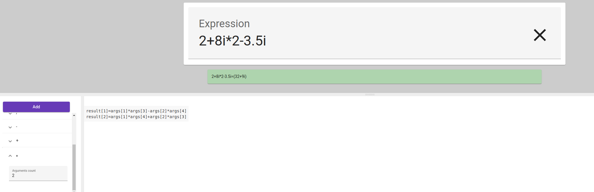

# Golculator

## Task description

Write a simple calculator with support of expression parsing.

### Requirements

- Support any math correct expressions with a primitive base operations
- Support unary operations
- Support  operations with complex numbers
- The calculator should have web-GUI
- Test coverage

### Optional

- Support of Quaternions and Octonions algebra
- Support user-defined functions

## Solution notes

- :book: standard Go project layout (or not :neutral_face:)
- :cd: github CI/CD + docker compose + Makefile included
- :card_file_box: PostgreSQL database

## HOWTO

- run with `make` (rebuild images) and go to [localhost:3000](http://localhost:3000)
- start with `make start` (without rebuild) and go to [localhost:3000](http://localhost:3000)
- test with `make test`

## A picture is worth a thousand words

